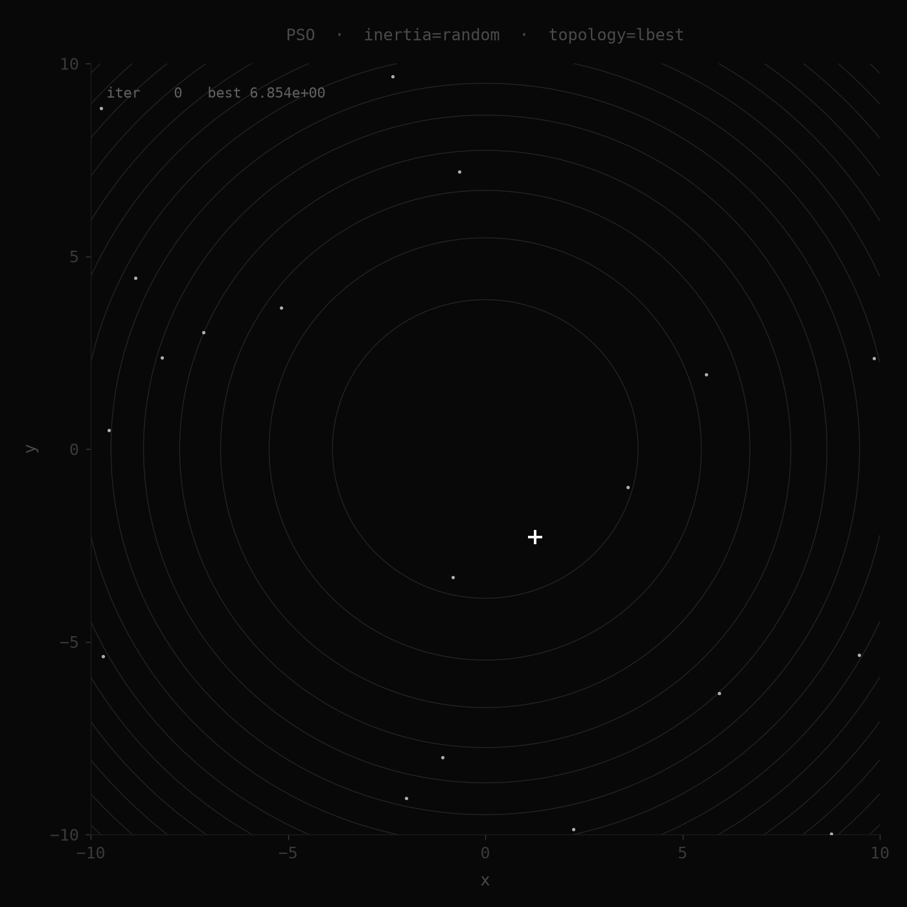

# Particle Swarm Optimization

A header-only C++20 PSO library with multi-threaded particle evaluation, swappable inertia and topology strategies, and a Python visualizer.



---

## Features

- **Multi-threaded** — particles split across hardware threads, barrier-synchronized per iteration
- **Swappable strategies** — plug in any inertia schedule or swarm topology at runtime
- **Type-safe API** — C++20 `CostFunction` concept enforces correct cost function signatures at compile time
- **Observer hooks** — zero-coupling telemetry (console, CSV, per-particle positions)
- **Header-only** — just add `include/` to your project

---

## Build

Requires CMake 3.20+, a C++20 compiler (GCC 11+ or Clang 14+), and an internet connection for the first build (fetches GoogleTest).

```bash
cmake -S . -B build -DCMAKE_BUILD_TYPE=Release
cmake --build build
```

Run tests:

```bash
cd build && ctest --output-on-failure
```

---

## Quick start

```cpp
#include "pso/pso.hpp"

pso::Config cfg;
cfg.n_dimensions = 5;
cfg.n_particles  = 30;
cfg.max_iter     = 500;
cfg.bounds       = std::vector<pso::Bounds>(5, {-10.0, 10.0});

auto cost = [](std::span<const double> x) {
    double s = 0;
    for (double xi : x) s += xi * xi;
    return s;
};

pso::PSO optimizer(cfg, cost);
auto result = optimizer.run();

std::cout << "best fitness: " << result.best_fitness << "\n";
std::cout << "converged:    " << (result.converged ? "yes" : "no") << "\n";
```

---

## Configuration

| Field          | Default              | Description                                  |
| -------------- | -------------------- | -------------------------------------------- |
| `n_particles`  | 30                   | Swarm size                                   |
| `n_dimensions` | 2                    | Search space dimensionality                  |
| `max_iter`     | 500                  | Maximum iterations                           |
| `n_threads`    | 0                    | 0 = `hardware_concurrency()`                 |
| `seed`         | 0                    | 0 = non-deterministic                        |
| `tol`          | 1e-6                 | Convergence threshold on global best fitness |
| `c1`           | 1.496                | Cognitive coefficient                        |
| `c2`           | 1.496                | Social coefficient                           |
| `bounds`       | (required)           | Per-dimension `{lo, hi}` bounds              |
| `inertia`      | `LinearDecayInertia` | Inertia strategy (see below)                 |
| `topology`     | `GBestTopology`      | Topology strategy (see below)                |

---

## Inertia strategies

`StaticInertia(w)` - Constant weight `w` throughout the run
`LinearDecayInertia(w_start, w_end)` - Linearly decays from `w_start` to `w_end`
`RandomInertia(w_min, w_max)` - Uniform random weight each iteration

```cpp
cfg.inertia = std::make_shared<pso::LinearDecayInertia>(0.9, 0.4);
```

---

## Topology strategies

`GBestTopology` - All particles attracted to the global best |
`LBestTopology(k)` - Each particle attracted to the best in its ring of `k` neighbors |

```cpp
cfg.topology = std::make_shared<pso::LBestTopology>(3);
```

---

## Observers

Attach observers to the `run()` call to collect data without modifying the optimizer:

```cpp
pso::ConsoleObserver console;
pso::CsvObserver     csv("convergence.csv");

optimizer.run({&console, &csv});
```

| Observer            | Output                                               |
| ------------------- | ---------------------------------------------------- |
| `ConsoleObserver`   | Prints best fitness and delta each iteration         |
| `CsvObserver`       | Writes `iter, best_fitness, mean_fitness` to CSV     |
| `PositionObserver`  | Writes per-particle `(x, y, fitness)` each iteration |
| `CompositeObserver` | Fan-out to multiple observers                        |

Implement `IObserver` to add your own.

---

## Benchmark functions

Located in `benchmarks/functions.hpp`:

| Function     | Known optimum | Notes                |
| ------------ | ------------- | -------------------- |
| `Sphere`     | 0             | Unimodal, separable  |
| `Rastrigin`  | 0             | Highly multimodal    |
| `Rosenbrock` | 0             | Narrow curved valley |
| `Ackley`     | 0             | Many local minima    |

---

## Visualization

Requires Python with `matplotlib`, `numpy`, and `Pillow`.

```bash
# Optional: create a venv
python -m venv .venv && source .venv/bin/activate
pip install matplotlib numpy Pillow

# Run and generate pso_animation.gif
python visualize.py --inertia linear --topology gbest
python visualize.py --inertia static --topology lbest
```

The script builds the C++ binary, runs it to produce `positions.csv`, then renders an animated GIF of the swarm converging on the Sphere function.

---

## Project structure

```
include/pso/
  config.hpp     — Config struct and Bounds
  pso.hpp        — PSO<CostFn> template class (core engine)
  particle.hpp   — Particle struct
  result.hpp     — Result struct
  inertia.hpp    — IInertia + strategy implementations
  topology.hpp   — ITopology + strategy implementations
  observer.hpp   — IObserver + built-in observers
benchmarks/
  functions.hpp  — Sphere, Rastrigin, Rosenbrock, Ackley
examples/
  basic.cpp      — Minimal end-to-end example
  visualize.cpp  — Writes positions.csv for the Python animator
tests/
  test_pso.cpp   — Google Test suite
```
